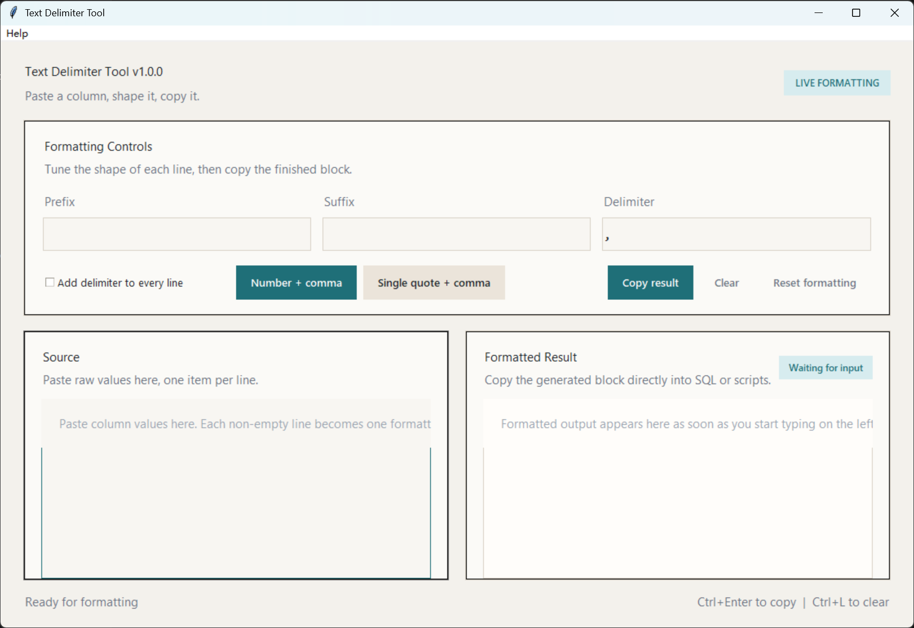

# Text Delimiter Tool

A lightweight Windows desktop utility for turning pasted multi-line text into delimiter-ready output.

一个轻量的 Windows 桌面工具，用来把粘贴的多行文本快速转换为可直接使用的分隔格式。

**Download EXE / 下载 EXE:** [TextDelimiterTool.exe](https://github.com/ALiang0918/text-delimiter-tool/releases/latest/download/TextDelimiterTool.exe)

## Preview | 界面预览




## Why This Tool | 这个工具解决什么问题

When you copy a single column of values from SQL results, Excel, or other tabular data, you often need to convert it into a format such as `1,`, `'1',`, or custom wrapped lines.

当你从 SQL 查询结果、Excel 或其他表格数据里复制出一列内容时，通常还需要把它转换成 `1,`、`'1',` 或其他带前后缀和分隔符的格式。

This app is built for that exact workflow: paste on the left, copy the formatted result on the right.

这个工具就是为这个高频场景准备的：左侧粘贴，右侧直接得到格式化结果。

## Before And After | 输入输出示例

Input | 输入:

```text
1
2
3
```

Output | 输出:

```text
1,
2,
3
```

Another output style | 另一种常见输出:

```text
'1',
'2',
'3'
```

## Features | 功能亮点

- Real-time formatting as you type or paste
- Side-by-side input and output editors
- Custom prefix, suffix, and delimiter
- Presets for common database formatting patterns
- Trim line whitespace and skip empty lines automatically
- One-click copy, clear, and reset actions
- Keyboard shortcuts for fast editing workflow
- Packaged Windows executable support

- 输入或粘贴后实时格式化
- 左右分栏，输入输出同时可见
- 支持自定义前缀、后缀、分隔符
- 内置常见数据库文本格式预设
- 自动去除行首尾空格并跳过空行
- 支持一键复制、清空、重置
- 提供快捷键提升处理效率
- 支持打包为 Windows 可执行文件

## Quick Start | 快速开始

### Run From Source | 从源码运行

```powershell
python run_app.py
```

### Run The Packaged EXE | 运行打包后的 EXE

After building, launch:

构建完成后，直接运行：

```text
dist\TextDelimiterTool.exe
```

## Keyboard Shortcuts | 快捷键

- `Ctrl+Enter`: copy formatted result
- `Ctrl+L`: clear input and keep focus in the source editor

- `Ctrl+Enter`：复制格式化结果
- `Ctrl+L`：清空输入并保持光标焦点

## Screens At A Glance | 使用方式

1. Paste source text into the left editor.
2. Adjust prefix, suffix, and delimiter if needed.
3. Use a preset for common formats.
4. Copy the generated output from the right side.

1. 在左侧输入区粘贴原始文本。
2. 按需调整前缀、后缀和分隔符。
3. 常见场景可直接点击预设。
4. 从右侧复制生成结果。

## Test | 测试

```powershell
$env:PYTHONPATH='src'
python -m unittest tests.test_formatter -v
python -m unittest tests.test_version -v
```

## Versioning | 版本管理

`VERSION` is the single source of truth.

`VERSION` 文件是唯一版本来源。

- The desktop app reads its displayed version from `VERSION`
- The packaging script reads the same `VERSION` file
- When releasing a new version, update `VERSION` only

- 桌面应用显示的版本号来自 `VERSION`
- 打包脚本读取同一个 `VERSION` 文件
- 发布新版本时，只需要修改 `VERSION`

## Build And Release | 构建与发布

### Prerequisites | 前置条件

- Windows PowerShell
- Python 3.13 or later
- `pyinstaller` installed in the selected Python environment

- Windows PowerShell
- Python 3.13 或更高版本
- 当前 Python 环境中已安装 `pyinstaller`

Install packaging dependency | 安装打包依赖：

```powershell
python -m pip install pyinstaller
```

### Verify Before Packaging | 打包前校验

```powershell
$env:PYTHONPATH='src'
python -m unittest tests.test_formatter -v
python -m unittest tests.test_version -v
```

### Build EXE | 构建 EXE

Recommended clean build | 推荐使用干净构建：

```powershell
powershell -ExecutionPolicy Bypass -File .\scripts\build.ps1 -Clean
```

Build output | 构建产物：

```text
dist\TextDelimiterTool.exe
```

### Standard Release Flow | 标准发布流程

1. Update `VERSION`.
2. Run local tests.
3. Build with `-Clean`.
4. Launch the generated `exe` once on the build machine.
5. Replace any previously distributed older executable.

1. 修改 `VERSION`。
2. 运行本地测试。
3. 使用 `-Clean` 执行打包。
4. 在构建机上手动启动一次新生成的 `exe`。
5. 用新文件替换此前分发过的旧版本可执行文件。

### GitHub Actions Release | GitHub Actions 自动发布

After implementation, pushing a tag such as `v1.0.1` will trigger GitHub Actions to validate the version, run tests, build `TextDelimiterTool.exe`, and upload it to the matching GitHub Release.

实现后，推送 `v1.0.1` 这类 tag 会自动触发 GitHub Actions 校验版本、运行测试、构建 `TextDelimiterTool.exe`，并上传到对应的 GitHub Release。
### Build Script Notes | 打包说明

- `assets\app.ico` is used automatically when present
- Windows file metadata is generated from `VERSION`
- The build script bundles `VERSION` into the PyInstaller package
- The app reads bundled runtime version data first, then falls back to development paths

- 存在 `assets\app.ico` 时会自动作为程序图标
- Windows 文件版本信息根据 `VERSION` 自动生成
- 打包脚本会把 `VERSION` 一并打进 PyInstaller 包内
- 应用会优先读取打包后的运行时版本文件，再回退到开发路径

Examples | 示例：

```powershell
powershell -ExecutionPolicy Bypass -File .\scripts\build.ps1 -Clean
powershell -ExecutionPolicy Bypass -File .\scripts\build.ps1 -Python py
powershell -ExecutionPolicy Bypass -File .\scripts\build.ps1 -Name MyDelimiterTool
```

## Project Structure | 项目结构

```text
src/text_delimiter_tool/
  app.py               Tkinter desktop UI
  formatter.py         Pure formatting logic
  version.py           App name and version loading
assets/
  app.png              Window icon asset
  app.ico              Windows executable icon
scripts/
  build.ps1            Windows packaging script
VERSION                Single source of truth for versioning
run_app.py             Local application entry point
README.md              Project overview and usage
```

## FAQ | 常见问题

### Why does the packaged EXE fail immediately? | 为什么打包后的 EXE 一打开就报错？

If a packaged `exe` fails immediately on startup, first confirm you are not launching an older build.

如果打包后的 `exe` 启动即报错，先确认你打开的不是旧版本构建产物。

A previously broken package could fail with an error like:

旧版错误打包可能会出现类似报错：

```text
FileNotFoundError: ... Temp\VERSION
```

That means the old package was built without bundling the `VERSION` file. Rebuild with the current `scripts\build.ps1` and redistribute the new `dist\TextDelimiterTool.exe`.

这表示旧包构建时没有把 `VERSION` 文件一起打进去。使用当前的 `scripts\build.ps1` 重新打包，并重新分发新的 `dist\TextDelimiterTool.exe` 即可。

### What kind of data is this tool for? | 这个工具适合处理什么数据？

It is designed for line-based plain text, especially values copied from database results, Excel columns, logs, or ID lists.

它适合处理按行排列的纯文本，尤其适合数据库结果列、Excel 单列数据、日志片段、ID 列表等场景。

### Does it monitor the clipboard automatically? | 会自动监听剪贴板吗？

No. The current scope focuses on manual paste, instant formatting, and quick copy.

不会。当前版本专注于手动粘贴、即时格式化和快速复制。

## Maintenance Rules | 维护约定

- Keep source files in `src/`
- Keep icons and visual assets in `assets/`
- Keep build and automation scripts in `scripts/`
- Do not commit generated artifacts from `build/`, `dist/`, `__pycache__/`, or `*.spec`
- If you change the version, update `VERSION` only

- 源码放在 `src/`
- 图标和视觉资源放在 `assets/`
- 构建和自动化脚本放在 `scripts/`
- 不提交 `build/`、`dist/`、`__pycache__/`、`*.spec` 等生成产物
- 调整版本时只修改 `VERSION`

## Current Scope | 当前范围

This project intentionally stays focused on local text formatting.

这个项目目前刻意保持在本地文本格式化这一清晰范围内。

Included | 已包含：

- Multi-line input formatting
- Preset formatting buttons
- Copy and clear workflow
- Windows packaging support

- 多行文本格式化
- 常用格式预设按钮
- 复制与清空工作流
- Windows 打包支持

Not included | 暂不包含：

- Clipboard monitoring
- File import/export
- SQL statement generation beyond line formatting
- Template persistence
- Sorting, deduplication, or data validation

- 剪贴板监听
- 文件导入导出
- 超出行格式化范围的 SQL 语句生成
- 模板持久化保存
- 排序、去重或数据校验
